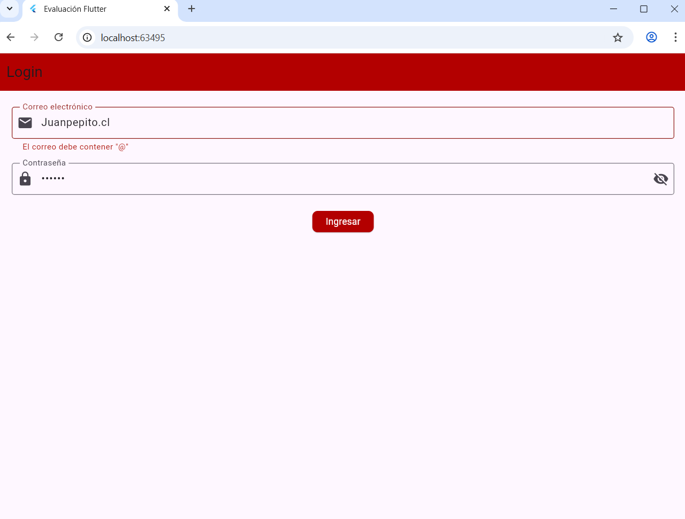
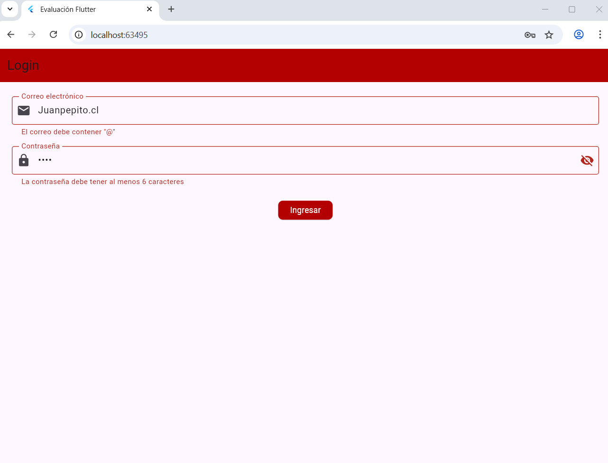
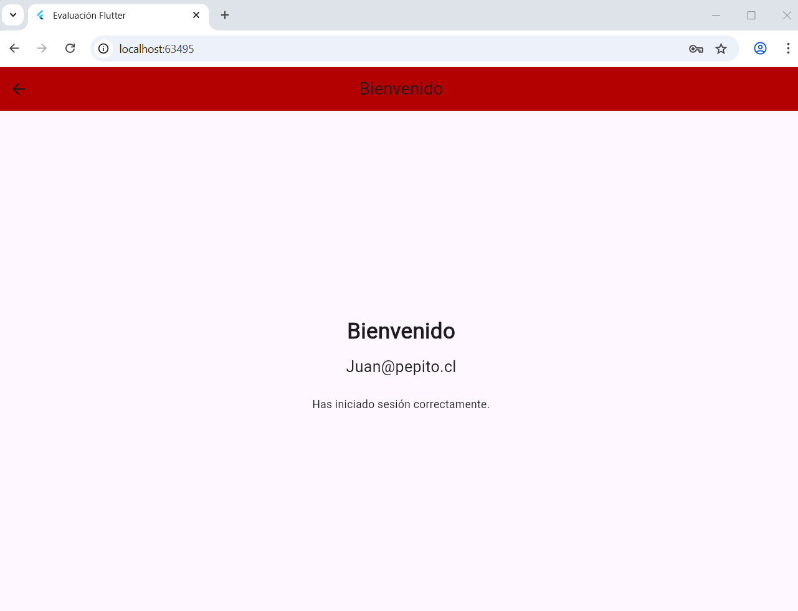

# Evaluación 1 - Aplicaciones Móviles
Alumno: Diego Negrete Espinoza
Sección: TI3V42  

## Instrucciones para ejecutar
1. Clonar repositorio:
   ```bash
   git clone https://github.com/michaelarjelm/AplicacionesMovilesIOTEvaluacionUno
   cd AplicacionesMovilesIOTEvaluacionUno

# Instalar dependencias:

flutter pub get

# Ejecutar en Chrome:

flutter run -d chrome

# Funcionalidades

Validación de correo (debe contener @).

Validación de contraseña (mínimo 6 caracteres).

Mensajes de error en caso de datos inválidos.

Navegación a pantalla de bienvenida con mensaje personalizado.

# Screenshots:

# Capturas




